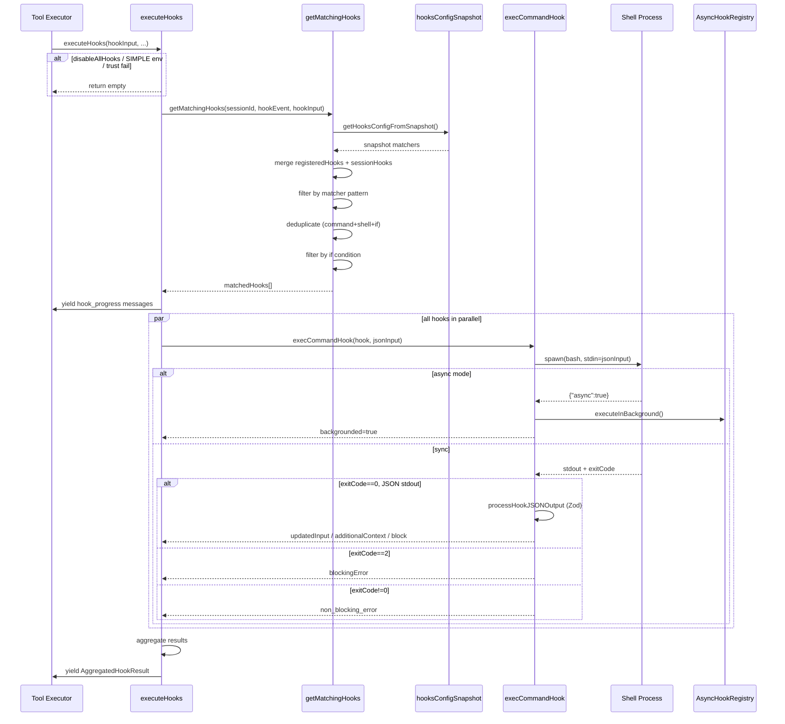

# Hook 子系统完全指南

> 日期：2026-04-02
> 覆盖主题：Hook 事件体系、Hook 类型、配置结构、继承层级、执行流程、典型应用场景
> 关键文件：`src/utils/hooks.ts` · `src/utils/hooks/` · `src/schemas/hooks.ts` · `src/types/hooks.ts`

---

## 概述

Hook 子系统是 Claude Code 的**事件驱动中间件层**，允许用户在 Claude Code 生命周期的任意节点注入自定义逻辑。它支持 26 个事件、5 种执行类型，可以读取工具输入、修改工具参数、阻断执行、注入上下文，或向外部系统发送通知。

所有 hook 的调度入口是 `src/utils/hooks.ts:executeHooks()`，匹配逻辑在 `getMatchingHooks()`，配置快照在 `src/utils/hooks/hooksConfigSnapshot.ts`。

---

## 一、Hook 事件体系

共 26 个事件，按关注域分为五类：

### 工具执行类

| 事件 | 触发时机 | 可修改输入 | 可阻断 |
|------|---------|-----------|--------|
| `PreToolUse` | 工具调用前 | 是（updatedInput） | 是 |
| `PostToolUse` | 工具成功后 | MCP 工具输出可改 | 是 |
| `PostToolUseFailure` | 工具失败后 | 否 | 否 |
| `PermissionRequest` | 权限弹窗出现时 | 否 | 是（deny/allow/ask） |
| `PermissionDenied` | auto mode 拒绝调用时 | 否 | 否 |

matcher 字段使用权限规则语法过滤 tool_name，例如 `Bash(git:*)` 只匹配 git 相关命令。

### 会话生命周期类

| 事件 | matcher 字段 | 说明 |
|------|-------------|------|
| `SessionStart` | source（startup/resume/clear/compact） | 会话开始，可区分首次启动与恢复 |
| `SessionEnd` | reason | 会话结束（logout/clear 等） |
| `Setup` | trigger（init/maintenance） | 仓库初始化或维护 |
| `SubagentStart` | agent_type | Agent 工具调用发起子 agent |
| `SubagentStop` | agent_type | 子 agent 结束 |

### 用户交互类

| 事件 | 说明 |
|------|------|
| `UserPromptSubmit` | 用户提交 prompt 时，可修改或阻断 |
| `Stop` | Claude 完成一轮回复后 |
| `StopFailure` | 本轮因 API 错误中断时，matcher 为 error 类型 |

### 压缩类

| 事件 | matcher | 说明 |
|------|---------|------|
| `PreCompact` | trigger（manual/auto） | 压缩前，可保存关键上下文 |
| `PostCompact` | trigger（manual/auto） | 压缩后，可重新注入状态 |

### 系统集成类

| 事件 | matcher | 说明 |
|------|---------|------|
| `Notification` | notification_type | 各类通知触发 |
| `ConfigChange` | source | 配置文件在会话中变更 |
| `InstructionsLoaded` | load_reason | CLAUDE.md 等指令文件加载时 |
| `Elicitation` | mcp_server_name | MCP server 请求用户输入 |
| `ElicitationResult` | mcp_server_name | 用户响应 MCP 请求后 |
| `WorktreeCreate` | — | 创建 git worktree 时 |
| `WorktreeRemove` | — | 删除 worktree 时 |
| `TeammateIdle` | — | 多 agent 协作中队友空闲 |
| `TaskCreated` | — | 任务被创建时 |
| `TaskCompleted` | — | 任务完成时 |
| `CwdChanged` | — | 工作目录切换后 |
| `FileChanged` | 文件名（basename） | 被监听的文件发生变化 |

---

## 二、Hook 类型

定义在 `src/schemas/hooks.ts`，支持 5 种类型：

| 类型 | 执行方式 | 适用场景 |
|------|---------|---------|
| `command` | Shell 进程（bash/powershell） | 格式化、测试、日志、通知 |
| `prompt` | LLM 评估（用 $ARGUMENTS 引用输入） | 语义校验、智能审批 |
| `agent` | 带工具的子 agent | 复杂验证、自动修复 |
| `http` | POST JSON 到外部 endpoint | CI/CD 集成、审计系统 |
| `callback/function` | 内部 JS 回调（SDK 使用） | 结构化输出、归因追踪等内部机制 |

所有类型共有字段：`if`（前置条件，权限规则语法）、`timeout`（秒）、`statusMessage`（UI 显示文字）、`once`（单次触发后自动移除）。

`command` 类型额外支持：`async`（后台执行）、`asyncRewake`（后台执行，exit code 2 时唤醒模型）。

---

## 三、配置结构

```json
{
  "hooks": {
    "PreToolUse": [
      {
        "matcher": "Bash(git:*)",
        "hooks": [
          {
            "type": "command",
            "command": "jq -r '.tool_input.command' >> ~/.claude/git-log.txt",
            "timeout": 10,
            "if": "Bash(git commit*)"
          }
        ]
      }
    ],
    "PostToolUse": [
      {
        "matcher": "Write|Edit",
        "hooks": [
          {
            "type": "command",
            "command": "jq -r '.tool_input.file_path' | { read -r f; prettier --write \"$f\"; } 2>/dev/null || true"
          }
        ]
      }
    ]
  }
}
```

Hook 通过 stdin 接收 JSON 格式的 `hookInput`，可以返回 JSON 控制执行流：

```json
{
  "continue": false,
  "stopReason": "安全策略拦截",
  "systemMessage": "显示给用户的提示",
  "hookSpecificOutput": {
    "hookEventName": "PreToolUse",
    "permissionDecision": "deny",
    "updatedInput": {},
    "additionalContext": "..."
  }
}
```

**exit code 语义**（command 类型）：

| exit code | 行为 |
|-----------|------|
| 0 | 成功，stdout 记录到 transcript |
| 2 | **阻断**，stderr 传给模型作为错误上下文 |
| 其他非零 | 非阻断错误，stderr 显示给用户 |

---

## 四、配置层级与合并规则

Hook **不是覆盖继承，而是合并叠加**——所有来源的 hook 都会被收集并并行执行。

```
来源（优先级从低到高）：
  builtinHook      内部 JS callback
  pluginHook       plugin hooks.json
  sessionHook      运行时注册（内存）
  userSettings     ~/.claude/settings.json
  projectSettings  .claude/settings.json
  localSettings    .claude/settings.local.json
  policySettings   managed-settings.json（企业管控）
```

企业管控（policySettings）可强制限制下层：

| 策略配置 | 效果 |
|---------|------|
| `disableAllHooks: true`（policySettings） | 全部禁用，包括 managed 自身 |
| `disableAllHooks: true`（非 managed） | 只禁 user/project/local，managed 仍执行 |
| `allowManagedHooksOnly: true` | 只执行 policySettings 里的 hooks |
| `strictPluginOnlyCustomization: ["hooks"]` | 只允许 plugin hooks |

**去重规则**（`src/utils/hooks/hooksSettings.ts:isHookEqual()`）：同一来源上下文中，`command + shell + if` 完全相同的 hook 只执行一次。跨 plugin 的同名 hook 不去重。

---

## 五、执行流程



---

## 六、典型应用场景

### 工具执行类

| 事件 | 典型场景 |
|------|---------|
| `PreToolUse` | 拦截危险命令（`rm -rf`、`DROP TABLE`）；修改文件路径；日志审计所有 Bash 命令；非工作目录文件禁止写入 |
| `PostToolUse` | 写文件后自动 prettier/gofmt；修改 .ts 后跑相关测试；eslint --fix；发 Slack 通知 |
| `PostToolUseFailure` | 工具失败上报监控；清理临时状态 |
| `PermissionRequest` | 特定路径自动 allow，其余 ask；企业合规记录 |
| `PermissionDenied` | 审计哪些操作被拒绝 |

### 会话生命周期类

| 事件 | 典型场景 |
|------|---------|
| `SessionStart(startup)` | 验证依赖已安装；加载项目状态注入模型；显示待办 |
| `SessionStart(resume)` | 恢复上次中断的上下文状态 |
| `SessionEnd` | 保存会话摘要；清理临时文件；上报用量 |
| `Setup(init)` | 首次进入项目自动 npm install、初始化数据库 |
| `Setup(maintenance)` | 定期清理缓存、更新依赖 |
| `SubagentStart/Stop` | 为子 agent 注入专属工具；收集子 agent 产出注入主 agent |

### 用户交互类

| 事件 | 典型场景 |
|------|---------|
| `UserPromptSubmit` | 展开别名（/deploy → 完整部署流程）；过滤 API key 明文；自动附加 git branch / PR 链接 |
| `Stop` | 每次回复后自动 npm run build；检查未提交修改；系统通知"Claude 已完成" |
| `StopFailure` | API 错误告警（邮件/钉钉） |

### 压缩与系统类

| 事件 | 典型场景 |
|------|---------|
| `PreCompact` | 提示用户确认保存关键变量；自动将重要状态写入文件 |
| `PostCompact` | 重新加载项目状态注入模型 |
| `Notification` | 权限请求时弹系统通知；按类型路由到不同渠道 |
| `WorktreeCreate` | 自动 npm ci；启动数据库容器 |
| `WorktreeRemove` | 清理 Docker 容器；关闭数据库连接 |
| `TaskCreated/Completed` | 同步到 Linear / Jira；完成时触发 CI |
| `FileChanged` | 监听配置文件热重载；.env 变更时提示重启 |

---

## 七、最常用组合

```bash
# 自动格式化（最常见）
PostToolUse(Write|Edit) → prettier / gofmt / rustfmt

# Bash 命令审计
PreToolUse(Bash) → 追加到 ~/.claude/bash-log.txt

# 每轮构建检查
Stop → npm run build || exit 2

# 用户提示词增强
UserPromptSubmit → 注入 git status + 当前 PR 信息

# 项目初始化
SessionStart(startup) → 检查 node 版本 + npm install

# 危险命令拦截
PreToolUse(Bash) if=Bash(rm -rf*) → exit 2 并输出告警
```

---

## 八、关键文件索引

| 文件 | 职责 |
|------|------|
| `src/entrypoints/sdk/coreTypes.ts:25` | Hook 事件枚举（26 个） |
| `src/schemas/hooks.ts` | Zod 配置 schema（5 种类型） |
| `src/types/hooks.ts` | 输入/输出类型定义 |
| `src/utils/hooks.ts:1603` | `getMatchingHooks()` 匹配逻辑 |
| `src/utils/hooks.ts:1976` | `executeHooks()` 核心调度 |
| `src/utils/hooks/hooksSettings.ts` | 多来源聚合、去重、优先级 |
| `src/utils/hooks/hooksConfigSnapshot.ts` | 启动时快照、策略管控 |
| `src/utils/hooks/hookEvents.ts` | 事件发射/观测 |
| `src/utils/hooks/execPromptHook.ts` | LLM hook 执行 |
| `src/utils/hooks/execAgentHook.ts` | Agent hook 执行 |
| `src/utils/hooks/execHttpHook.ts` | HTTP hook 执行 |
